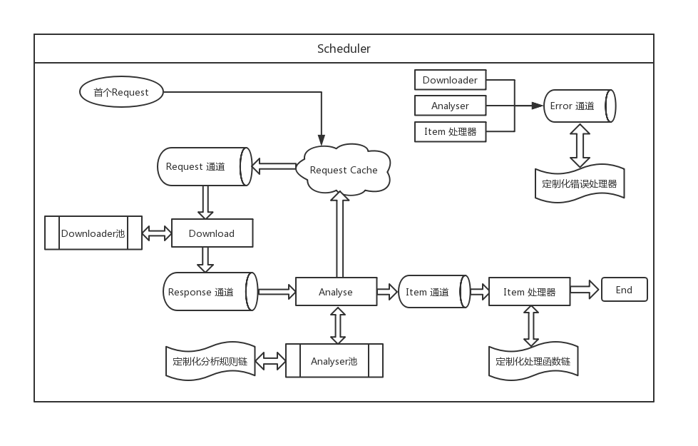

## 一个简单的爬虫框架

#### 运行：
1. go get github.com/hq-cml/spider-go
2. cd 目录
3. go build ./
4. ./spider-go -c "conf/spider.conf" -f "https://www.360.cn" -u "老周"

#### 特点：
1. 尽量利用了Go的高并发的特性, 使得单机的爬取效率依旧较高
2. 尽量利用接口封装, 保证可扩展, 比如中间件和爬取插件等等,都可以在接口实现的前提下进行替换
3. 目前只实现了一个基本插件, 支持比较简单的关键字匹配功能, 比如从360主站开始搜索全部"老周"的网页

#### 目录说明：
1. basic：基本数据类型定义
2. conf：配置文件
3. helper：业务无关的工具
4. logic: 核心业务代码
5. middleware: 中间件
6. plugin: 爬虫逻辑插件
7. vendor: 依赖

#### 架构图：

##### 说明：
如上图
1. 调度器负责全局各个模块的调度, 核心工作是将请求从缓存中运送到请求Channel
2. downloader负责下载工作,产出是Response,下载并发度通过downloader池子来控制
3. analyzer负责分析工作,输入Response,产出是新的Request和Item项
4. processor负责最终Item的处理
5. 其中analyzer和processor的行为支持用户通过插件的形式定制
6. 中间件主要负责各个模块之间的缓冲

#### TODO：
1. 爬虫插件的逻辑丰富
2. 分布式爬虫
